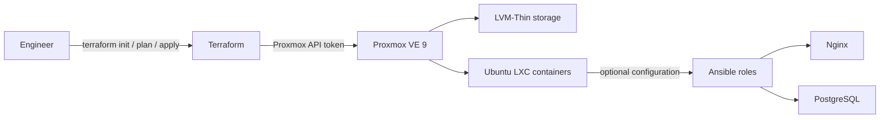

# Terraform Proxmox Lab

A portfolio home lab that demonstrates a practical infrastructure delivery path: define repeatable infrastructure with Terraform, provision Ubuntu LXC containers on Proxmox VE, and prepare them for configuration with Ansible.

## Architecture



## What this demonstrates

- Terraform configuration split into provider, variables, outputs, and a reusable LXC container module.
- Proxmox API-token authentication and variable-driven configuration.
- Ubuntu LXC deployment on dedicated LVM-Thin storage.
- Ansible roles for common Nginx and PostgreSQL configuration.
- Practical network troubleshooting: the lab uses static addressing after diagnosing DHCP issues with LXC containers.

## Quick Start

### Prerequisites

- Terraform installed locally.
- Access to a Proxmox VE instance with an API token authorized to create LXC containers.
- An LXC template and storage names that match your local Proxmox environment.
- Optional: Ansible, for post-provision configuration.

### Plan the infrastructure

Clone the repository, create a local variables file, and fill in your own Proxmox endpoint, API token, storage, template, and network values. The local `terraform.tfvars` file should never be committed.

```bash
git clone https://github.com/marksallee/terraform-proxmox-lab.git
cd terraform-proxmox-lab/terraform
cp terraform.tfvars.example terraform.tfvars
# Edit terraform.tfvars with your own environment values
```

Initialize Terraform and check the configuration before making any infrastructure changes:

```bash
terraform init
terraform fmt -check
terraform validate
terraform plan -out=tfplan
```

Review the plan carefully. When it matches the intended change, apply the saved plan and inspect the outputs:

```bash
terraform apply tfplan
terraform output
```

> **Safety note:** this project creates real Proxmox resources. Start with a disposable lab container, keep API tokens out of Git, and destroy only resources you intend to remove: `terraform destroy`.

## Repository Layout

```
terraform/   Terraform root module and reusable LXC module
ansible/     Post-provisioning roles and playbooks
docs/        Lab notes and supporting documentation
```

## Roadmap

- [ ] Deploy multiple containers from reusable module inputs.
- [ ] Add GitHub Actions checks for `terraform fmt` and `terraform validate`.
- [ ] Add a deployed-lab screenshot and a redacted example plan.
- [ ] Add monitoring services to the lab.

## License

See [LICENSE](LICENSE).
